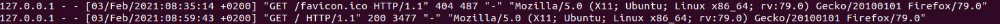
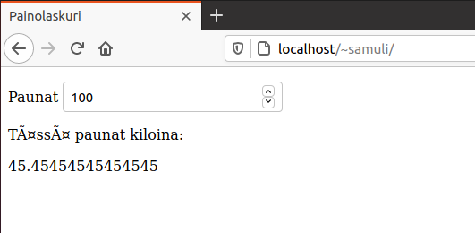
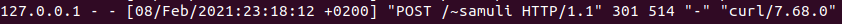
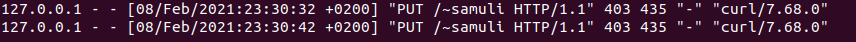

# Tehtävä 3

# a)
Apache asentui komennolla ```sudo-apt get install apache2```, jonka jälkeen tuli vielä ajaa tunnilla läpi käydyt komennot
```
sudo a2enmod userdir
sudo /etc/init.d/apache2 restart
```
Jotta sivu saatiin näkyviin, tuli luoda kansio nimeltä ```public_html```, johon piti luoda ```index.html``` -tiedosto, johon pystyy kirjoittelemaan perus-HTML:ää. Sivustoni lähdekoodi kokonaisuudessaan on:
```
Hello and welcome to my apache2-powered website!
```

# b)

Kuvakaappauksesta näkee, että sivulla tulee 404 favicon.icon GET-pyynnössä. Tämä johtuu siitä, ettei sivustolla ole vielä faviconia. Mozilla yrittää tästä huolimatta löytää sellaista, vaikkei sitä löydykään. 
Seuraava rivi puolestaan on koodilla 200, eli OK. Tämä johtuu siitä, että HTTP 1.1-pyyntö menee onnistuen läpi. 

# f)

Tein yksinkertaisen laskurin, jolla voi laskea paunat kiloiksi. 
Tässä laskurin pitkä lähdekoodi: 
```
<p>
  <label>Paunat</label>
  <input id="paunat" type="number" placeholder="paunat" oninput="painoLaskuri(this.value)" onchange="painoLaskuri(this.value)">
</p>
<p>Tässä paunat kiloina: <div id="kilot"></div></p>

<script>
function painoLaskuri(numero) {
  document.getElementById("kilot").innerHTML=numero/2.2;
}
</script>
```
Tässä vielä kuvakaappaus laskurista ja selaimesta:

# i)

Edellä mainitut HTTP-statuskoodit ovat helppoja saada aiheutettua tekemättä mitään muutoksia koodiin. 
403 on myös hyvin helppo aiheuttaa, jos ei aja komentoa  ```sudo a2enmod userdir```

Yrittämällä tehdä seuraavaa POST-pyyntöä
```
curl --header "Content-Type: application/json" \
  --request POST \
  --data '{"username":"erkkiesimerkki","password":"salasana123"}' \
  http://localhost/~samuli
```
 suoraan osoitteeseen ```localhost/~samuli``` sain aikaiseksi 301- Permanently moved -virhekoodin. 


Toivoin saavani aikaiseksi aiemmalla POST-pyynnöllä sekä seuraavalla PUT-pyynnöllä 405-statuksen, mutten onnistunut. PUT-antaa 403:sen ja POST antaa 200:sen, joten nämä jäivät ikävä kyllä saamatta, vaikka niitä onkin koodatessa sattunut. 
```curl -X PUT -d arg=val -d arg2=val2 localhost/~samuli```


# m)

Seurasin [Tätä erinomaista ohjetta 😉](http://terokarvinen.com/2016/new-default-website-with-apache2-show-your-homepage-at-top-of-example-com-no-tilde/), jonka avulla sain localhostin etusivulle pyörimään f-tehtävän painolaskurin. 

En saanut komennolla ```sudoedit``` .conf-tiedostoa muutettua, mutta komennolla ```sudo nano /etc/apache2/sites-available/tero.conf``` sain muutettua tiedoston vastaamaan ohjeessa annettua. 
Tämän jälkeen ajoin komennot, jotka asettavat uuden .conf-tiedoston oletukseksi ja poistavat vanhan:
```
$ sudo a2ensite samuli.conf
$ sudo a2dissite 000-default.conf
```
Nyt oletussivu on vielä sama vanha, mutta komennolla ```sudo service apache2 restart``` apache käynnistyy uudelleen ja painolaskuri ilmestyy oletussivulle. 