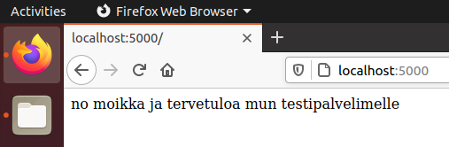
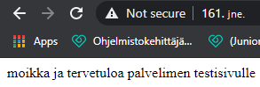

# Tehtävä 5
## a) 
Tein tehtävän debuggausmoodissa VM:n sisällä. 
Flaskin asentamiseksi asentamiseen vaadittiin komento `sudo apt-get -y install python3-flask`, jonka jälkeen loin komennolla `nano heimaailma.py` tein uuden tiedoston, jonka sisään aloin kirjoittelemaan webbikoodia. 
Hei-maailma-ohjelmani koodi on seuraava: 
```
from flask import Flask
app = Flask(__name__)

@app.route("/")
def hei_maailma():
    return "no moikka ja tervetuloa mun testipalvelimelle"
```


## b)
Tein aivan ensi alkuun viime viikon tehtävän mukaisesti uuden palvelimen, sillä viimeviikkoinen meni saman tien oikeaan käyttöön. 😁

Tein tehtävän terokarvinen.com:in [täältä](http://terokarvinen.com/2020/deploy-python-flask-to-production/) löytyvien ohjeiden mukaan. Jouduin uudelle palvelimelle asentamaan UFW:n sekä apache2:n komennoilla `sudo apt-get -y install apache2` ja `sudo apt-get install ufw`. Tein palomuurin porttiin reiän komennolla `sudo ufw allow 80/tcp` ja käynnistin palomuurin uudelleen komennolla `sudo ufw enable`. Tässä vaiheessa korvasin apachen oletussivun ylemmän linkin ohjeista löytyvällä komennolla `echo "moikka ja tervetuloa palvelimen testisivulle" | sudo tee /var/www/html/index.html`, jonka jälkeen oletussivu vaihtui seuraavanlaiseksi. 



Tein uuden käyttäjän sovellusta varten komennolla `sudo adduser samuliwsgi` ja annan sille vahvan salasanan. Tämän jälkeen suljen käyttäjän kirjautumisen komennolla `sudo usermod --lock samulwsgi` ja lisään itseni edellä mainitsemaan usergroupppiin komennolla `sudo adduser samuli samuliwsgi`. Seuraavaksi kirjaudun ulos komennolla `logout` ja sen jälkeen otan uuden SSH-yhteyden komennolla `ssh samuli@<ip-osoite>`.

Tein uuden wsgi.conf tiedoston komennolla `sudo nano /etc/apache/sites-available/samuliwsgi.conf`, jonka sisään vaihdoin asetukset vastaamaan seuraavia: 
```
<VirtualHost *:80>
        ServerName samuli.example.com

        WSGIDaemonProcess samuliwsgi user=samuliwsgi group=samuliwsgi threads=5
        WSGIScriptAlias / /home/samuliwsgi/public_wsgi/samuli.wsgi

        <Directory /home/samuliwsgi/public_wsgi/>
                WSGIScriptReloading On
                WSGIProcessGroup samuliwsgi
                WSGIApplicationGroup %{GLOBAL}
                Require all granted
        </Directory>
</VirtualHost>
```
Tämän jälkeen asensin WSGI:n komennolla `sudo apt-get -y install libapache2-mod-wsgi-py3` ja käynnistin apachen uudelleen komennolla `sudo systemctl restart apache2`. Tämän jälkeen vaihdoin oletus-conffitiedoston komennoilla `sudo a2ensite samuliwsgi.conf` ja `sudo a2dissite 000-default.conf`.Tämän jälkeen käynnistin vielä apachen uudelleen, koska vaihdoin conffiasetuksia. 

Kokeilin ladata sivua curlilla, komennolla `curl localhost` joka oletettavasti johti 403:een. Curl palautti seuraavan syötteen:
```
<!DOCTYPE HTML PUBLIC "-//IETF//DTD HTML 2.0//EN">
<html><head>
<title>403 Forbidden</title>
</head><body>
<h1>Forbidden</h1>
<p>You don't have permission to access this resource.</p>
<hr>
<address>Apache/2.4.38 (Debian) Server at localhost Port 80</address>
</body></html>
``` 

Jotta pääsemme katselemaan palvelimella kaunista flaskitiedostoamme, joudumme tekemään public_wsgi-kansion komennolla `sudo mkdir /home/samuliwsgi/public_wsgi` ja asettamaan oikeuksia käyttäjälle sekä käyttäjäryhmälle samuliwsgi, jottei meidän tarvitse käyttää sudoa kotihakemistossa (vaikka se niin kivaa onkin). Tämä onnistuu komennolla `sudo chmod g=rwxs /home/samuliwsgi/public_wsgi`. 

Seuraavaksi teemme .wsgi-tiedoston komennolla `nano /home/samuliwsgi/public_wsgi/samuli.wsgi`. (wau, elämä ilman sudoa onkin kaikkea muuta paitsi harmaata). wsgi-tiedostoon kirjoitamme seuraavan koodinpätkän: 
```
import sys
assert sys.version_info.major >= 3, "Python version too old!"

sys.path.insert(0, '/home/samuliwsgi/public_wsgi/')
from moimaailma import app as application
```
Edellämainittu rimpsu pääasiassa kertoo, mistä tiedostosta haemme flaskisovelluksemme. Tässä tapauksessa se on `moimaailma.py`. Koodinpätkä myös herjaa liian vanhasta python-versiosta. Tämän jälkeen voimme luoda edellä mainitun tiedoston komennolla `nano /home/samuliwsgi/public_wsgi/moimaailma.py`, jonka sisällöksi laitoin seuraavaan: 
```
from flask import Flask
app = Flask(__name__)

@app.route("/")
def moimaailma():
        return "moikka kaikki ja tervetuloa mun OIKEALLE palvelimelle :D"
```

Tämän jälkeen voimme käydä testaamassa sivua joko curlilla tai selaimella. Selaimesta näkyy seuraava näkymä: 


Jes, sehän toimii. Kyllä tästä vielä saadaan hitti muutamalla kissakuvalla. 

## c)
Seuraavaksi ruvetaan valjastamaan templateja sivulle, koska turha HTML-tägien kirjoittelu ei ole kenenkään (normaalin ihmisen) mielestä kivaa. Tämä on onneksi helppoa ja onnistuu ihan vain muutamalla komennolla. 
Ensin tulee tehdä `public_wsgi-kansioon` uusi kansio nimeltä `templates`, jonka jälkeen teemme uuden templaten komennolla `nano templates/base.html`. Tähän tiedostoon voimme kirjoittaa mitä vain haluamme templaten palauttavan, esimerkin vuoksi lisään tiedostoon tervehdyksen templatelta, mutta oikeassa käytössä sen ainakin kannattaisi olla suhteellisen tyhjä. `base.html`-tiedostoon laitan pohjaksi seuraavan. 
```

<!doctype html>
<html>
	<head>
		<title>templatetestisivu</title>
		<meta charset="utf-8">
	</head>
	<body>
		<p>
			Template tässä morjensta
		</p>
	</body>
</html>
```

Seuraavaksi lisäämme muutaman sanasen `moimaailma.py`-tiedostoon. Viimeistelty tiedosto näyttää tältä
```
from flask import Flask, render_template
app = Flask(__name__)
@app.route('/')
def moimaailma():
 return render_template("base.html")
```

Muutokset ovat ainoastaan render_template()-metodin importtaaminen sekä kyseisen metodin käyttäminen, jonka meille palautuu kaunis HTML-dokumentti. 

Tämän jälkeen lataan apachen varmuuden vuoksi uudelleen komennolla `sudo systemctl restart apache2`, jonka jälkeen kokeilen ladata sivua curlilla komennolla `curl localhost`, joka palauttaa seuraavan syötteen:
```
...
 <title>templatetestisivu</title>
                <meta charset="utf-8">
        </head>
        <body>
                <p>
                        Template tässä morjensta
                </p>
...
```
Toimivalta näyttää, vältymme tulevaisuudessa webbihommien tylsimmältä osuudelta. Kiva juttu. 

## d)

Seuraavaksi lähdemme toteuttamaaan sivustoa, jolta käyttäjä voi katsoa oman ip-osoitteensa. Rupeamme rakentamaan tätä edellisen templaten päälle, johon jätän templaten tervehdyksen selkeyttämään sen toimintaa. Tähän tehtävään ei myöskään tarvitse muuttaa montaa asiaa. 
Templateen tulee lisätä seuraavalla tavalla muuttuja: `{{ip}}`, jonka lisäksi moimaailma.py-tiedostoon tulee tehdä aivan pikkiriikkisiä muutoksia. Tämän voimme lisätä esimerkiksi templaten tervehdyksen perään. 
Meidän tulee importata Flaskistä request, jonka lisäksi meidän pitää noutaa vierailijan ip-osoite sekä palauttaa ip-osoite templaten muuttujaan, jonka jo teimme. 
Tiedosto näyttää tältä muutoksien jälkeen 

```
from flask import Flask, render_template, request #request lisätty
app = Flask(__name__)
@app.route('/')
def moimaailma():
    ip_address = request.remote_addr #tässä tallennamme ip_address-muuttujaan vierailijan ip-osoitteen käyttämällä request-olion remote-addr attribuuttia. 
    return render_template("base.html", ip=ip_address) # palautamme HTML-dokkaripohjalle muuttujan ip, jonka arvo on ylemmällä rivillä määrittämämme ip_address
```
Tämän jälkeen voimme tehdä curlila get-pyynnön localhostiin, joka palauttaa seuraavan: 
```
...
                <p>
                        Template tässä morjensta, ip-osoitteesi on 127.0.0.1
                </p>
...
``` 
Jes, sovellus osaa ainakin palauttaa localhostin osoitteen. 
Voimme myös kokeilla navigoida selaimessa palvelimen ip-osoitteeseen ja havaita, että palvelimen antama ip-osoite vastaa ulkoista ip-osoitettani. 
