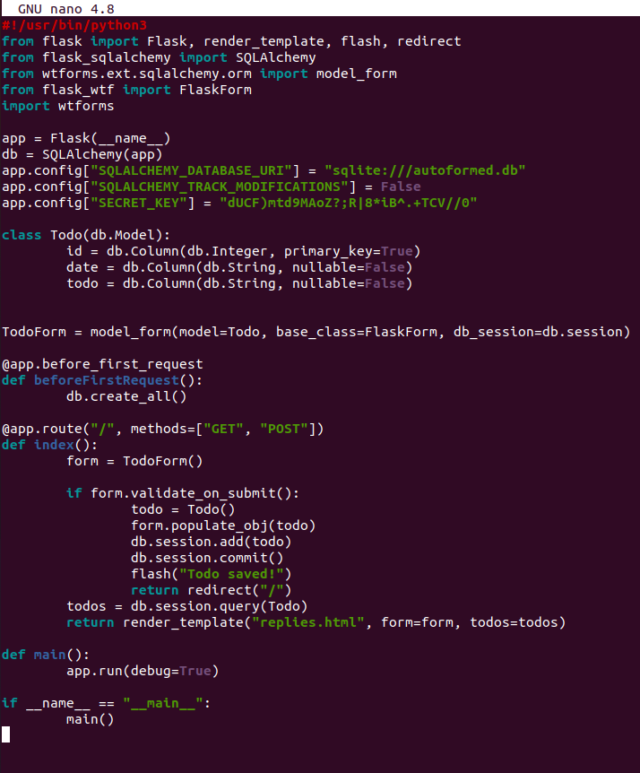
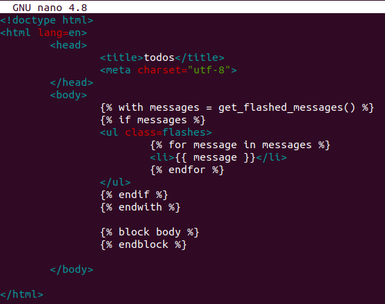
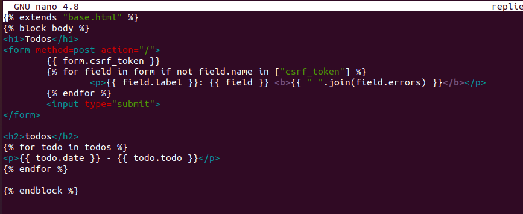
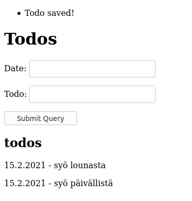

Pahoittelut tehtävän myöhästymisestä, yritin kovasti saada sovellusta toimimaan palvelimella WSGIn kanssa, mutten saanut jostain syystä SQLalchemyä toimimaan palvelimella, vaikka se toimikin ubuntun sisällä mainiosti. 
# a) 

Teen tehtävää varten todo-sovelluksen. Käytän tähän sqliteä, sillä sovellus on hyvin kevyt, eikä data ole kovin tärkeää. 
Tein koodin terokarvinen.comin esimerkkikoodia mukaillen.
http://terokarvinen.com/2020/flask-automatic-forms/

Todos.py näyttää seuraavalta: 

todos.html template näyttää seuraavalta: 

ja base.html template näyttää seuraavalta: 

Flaskin autogeneroidut formit ovat hienoja, niiden avulla on todella helppo luoda formi, joka sopii omaan tietokantatauluun. 

Valmis verkkosivu näyttää selaimessa tältä.

Alla oleva lista todo-olioista on todos.html-templaten generoima. Siellä käydään jokainen tietokannassa oleva todo-"olio" läpi ja listataan niiltä date- sekä todo-ominaisuuet. Kuten edellä mainitsin, itse lomake on flaskin generoima. Flask osaa pienen säädön avulla kirjoittaa otsikon kentille ja tallentaa tiedon tietokantaan form.validate_on_submit()-metodin avulla. Alkuperäisessä esimerkkikoodissa oli myös hyvä demo siitä, kuinka sähköpostiosoitteet voidaan validoida automaattisesti. 

# b 
Sain edellisen tehtävän toimimaan Ubuntun sisällä hyvin, mutten saanut palvelimelle sitä asennettua. Flask valittaa, ettei sqlalchemyä ole asennettuna, vaikka olen yrittänyt asentaa sitä pipin sekä apt-getin avulla. Tarkka virhe, minkä saan var/log/apache2/error.log:iin on `ModuleNotFoundError: No module named 'flask_sqlalchemy'`
