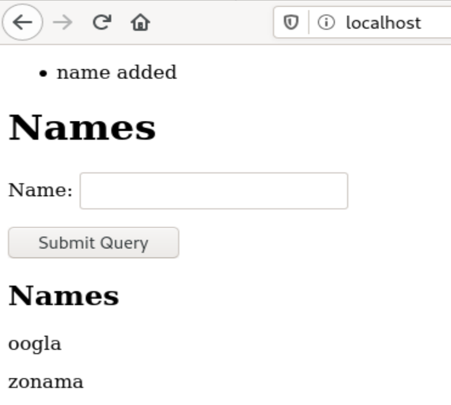

# Tehtävä 7

Tein vuoden 2019 laboratiorioharjoituksen, linkki siihen tässä: http://terokarvinen.com/2019/arvioitava-laboratorioharjoitus-linux-palvelimet-ict4tn021-3004-ti-alkukevat-2019-5-op/

Asensin aivan ensimmäisenä puhtaan Debian 10.8:n.

Tämän jälkeen aloin asentamaan LAMP-stackiä. 
Apachen asennus hoitu klassisella `sudo apt-get -y install apache2` ja `sudo systemctl restart apache2`
Seuraavaksi asensin flaskin sekä psycopg2:n komennolla `sudo apt-get -y install python3-flask-sqlalchemy python3-psycopg2`
Tein LAMP-sovelluksen kuten viime viikolla ja noudatin omia kotitehtäväohjeitani, ongelmia ei tullut vastaan, joten en koe tarpeelliseksi mainita sen tekemisestä.¨

Maijalle käyttäjän tekeminen onnistuu komennolla `sudo adduser maija`

Seuraavaksi vaihdan oletussivun pois apache2 sivusta komennolla `echo "testi"|sudo tee /var/www/html/index.html`

Ohje wsgin käyttöönottoon löytyy täältä, sen olen kuitenkin tehnyt ja kommentoinut niin monessa tehtävässä, että en sitä koe tarpeelliseksi tehdä nyt. 
https://terokarvinen.com/2020/deploy-python-flask-to-production/





`goodmorning.sh` skriptin tekeminen onnistuu komennolla `nano goodmorning`. Sisällöksi tiedostoon laitan: 
```
#!/bin/bash
echo "hyvää huomenta"
hostname -I
date

```
Jotta kaikki saavat suorittaa skriptin, annan oikeudet `chmod a+x goodmorning`, jonka jälkeen kopioin sen kaikille käytettäväksi: `sudo cp goodmorning /usr/local/bin`, jonka jälkeen sitä voi käyttää kaikki käyttäjät, kaikista hakemistoista. 


Kiireiden vuoksi joudun jättämään loput tästä tehtävästä huomiselle, tehtävä tuleekin myöhästymään. Pahoittelut tästä jälleen. 